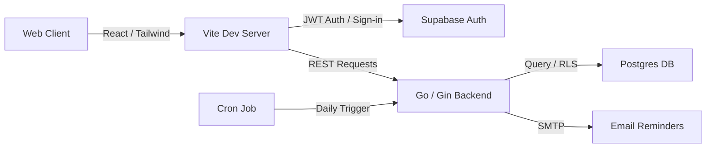

Keeping track of monthly and annual software subscriptions can quickly get messy. To solve this problem for myself—and to experiment with modern full-stack architectures—I built **SubTrackr**, a clean, responsive subscription management web application. 

Here is a look at the architecture, security decisions, and engineering lessons behind the project.

---

## Tech Stack Overview

SubTrackr is built on a split architecture designed to isolate concerns, facilitate independent testing, and enforce data security:

* **Frontend:** React 18, Vite (for extremely fast builds), Tailwind CSS (for modern UI styling), and Lucide React (icons).
* **Backend:** Go (1.21+) using the lightweight **Gin** web framework for REST API routing.
* **Database & Auth:** **PostgreSQL** hosted via **Supabase**, leveraging Supabase Auth for identity management.



---

## Architecture Highlight: Row Level Security (RLS)

When hosting database tables on shared infrastructure, ensuring that users can only read, write, or modify *their own* records is critical. Instead of handling all database isolation rules in application code, I offloaded this to PostgreSQL using **Row Level Security (RLS)** in Supabase.

Every subscription record is tagged with a `user_id` field mapped to Supabase’s authentication profiles. We then enable RLS on the `subscriptions` table and establish policies:

```sql
-- Enable Row Level Security
ALTER TABLE subscriptions ENABLE ROW LEVEL SECURITY;

-- Allow users to view only their own subscriptions
CREATE POLICY "Users can view own subscriptions" ON subscriptions
  FOR SELECT USING (auth.uid()::text = user_id);

-- Allow users to insert only their own subscriptions
CREATE POLICY "Users can insert own subscriptions" ON subscriptions
  FOR INSERT WITH CHECK (auth.uid()::text = user_id);

-- Allow users to update only their own subscriptions
CREATE POLICY "Users can update own subscriptions" ON subscriptions
  FOR UPDATE USING (auth.uid()::text = user_id);

-- Allow users to delete only their own subscriptions
CREATE POLICY "Users can delete own subscriptions" ON subscriptions
  FOR DELETE USING (auth.uid()::text = user_id);
```

By delegating isolation to PostgreSQL policies, the database itself guarantees that even if a bug in our application code attempts to access another user's UUID, the database will return an empty set.

---

## Backend Design: Go & Gin

The backend is written in Go, chosen for its fast execution, minimal memory footprint, and compile-time type safety. 

We structure the API endpoints cleanly:
- `GET /api/v1/subscriptions` - Retrieve all user subscriptions.
- `POST /api/v1/subscriptions` - Create a subscription.
- `PUT /api/v1/subscriptions/:id` - Update details (price, renewal date, etc.).
- `DELETE /api/v1/subscriptions/:id` - Remove a subscription.

### Automated Email Reminders
A key feature of SubTrackr is alerting users three days before a subscription renews. The backend exposes an endpoint to trigger email sweeps:

```bash
POST /api/v1/reminders/send?days=3
```

This endpoint queries subscriptions whose next renewal date is exactly 3 days away, formats an email body, and dispatches alerts via SMTP. To make this hands-free, we schedule a daily cron job:

```bash
0 9 * * * curl -X POST http://localhost:8080/api/v1/reminders/send?days=3
```

---

## Testing Strategy

To maintain a production-ready codebase, both frontend and backend are thoroughly covered by automated test suites.

### Frontend Testing
Using **Vitest** and **React Testing Library**, the frontend suite validates:
* Component rendering states (e.g., displaying empty states when no subscriptions are present).
* Mocking authentication state responses.
* User interactions (form validation, clicking edit buttons, deleting entries).

### Backend Testing
Go's built-in testing framework is paired with **testify** (for structured assertions) and **sqlmock** (for mocking database operations):
* **Unit Tests:** Handlers are tested in isolation using Go's `httptest` package, simulating HTTP requests and checking response codes and JSON bodies.
* **Database Mocking:** `sqlmock` intercepts SQL commands, confirming that the Gin handlers execute the correct queries without needing a running database instance.
* **Integration Tests:** Execute end-to-end API workflows against a isolated local test database using a dedicated test database URL.

---

## Lessons Learned

1. **Leveraging DB-Level Security:** Moving user-isolation policies to the database level (RLS) simplifies backend logic. The API server doesn't need to manually check permissions on every query—the database handles it natively.
2. **Go's Concurrency for Background Tasks:** When dispatching bulk reminder emails, Go's goroutines make it trivial to handle SMTP network calls concurrently, preventing the HTTP trigger request from hanging.
3. **Structured Testing Pays Off:** Using `sqlmock` early in the backend development saved hours of debugging database connection logic and made unit tests run in milliseconds.

SubTrackr started as a simple weekend utility, but building it with robust testing, robust database-level security policies, and a compiled backend made it a great sandbox for practicing clean architectural habits.
