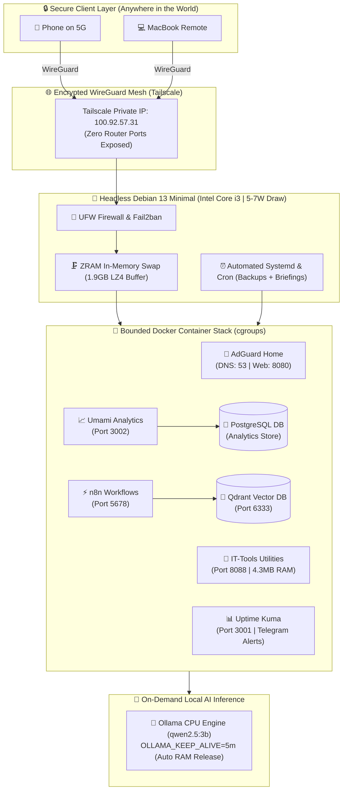

## Transforming an Old Laptop into a Silent Linux Server & Private AI Homelab

Most homelab discussions start with buying expensive multi-core mini PCs, setting up noisy rack servers, or paying high monthly electricity bills.

I did not want any of that. 

I had an old, decommissioned dual-core laptop (Intel Core i3 with 4GB RAM) sitting in my drawer. Instead of letting it gather dust or buying new hardware, I decided to turn it into a dedicated, headless Debian 13 micro-server. 

Today, it runs local AI models, vector memory, DNS ad-filtering, web analytics, and workflow automation 24/7. It stays completely silent, runs cool at around 45°C, and draws around 5 to 7 Watts of power.

Here is how I set it up and the exact engineering decisions that made it work.

## Why an Old Laptop Makes Sense

An old laptop has a few huge advantages over a bare mini PC that people often overlook:

- **Built-in battery backup (UPS)**: If the power flickers or I accidentally trip a plug, the laptop battery keeps everything online. No sudden dirty shutdowns and no corrupted databases.
- **Very low power draw**: It sips about 5–7W at idle. In Canada, that costs roughly $1.50 a month to run 24/7.
- **Whisper quiet**: With low CPU load and good thermal scaling, the fan stays off or barely audible.

To make it run properly as a headless server, I disabled sleep when the lid is closed:

```bash
# /etc/systemd/logind.conf
HandleLidSwitch=ignore
HandleLidSwitchExternalPower=ignore
HandleLidSwitchDocked=ignore
```

I also turned off the display backlight on boot so it does not waste battery or generate extra heat.

## Memory Strategy: ZRAM and Swappiness

Running 7 containers and an AI model on 3.7 GB of usable RAM requires discipline. If the Linux kernel starts aggressively thrashing to a physical SSD swap, the server freezes and you wear out your drive fast.

I used **ZRAM (LZ4 compressed in-memory swap)** instead:

```bash
sudo apt-get install -y zram-tools
```

In `/etc/default/zramswap`:

```ini
ALGO=lz4
PERCENT=50
PRIORITY=100
```

This creates a compressed swap space directly in RAM. When memory pressure builds up, the kernel compresses inactive pages into RAM instead of writing to disk.

I also tuned the kernel parameters in `/etc/sysctl.d/99-homelab-tuning.conf`:

```ini
# Do not swap unless memory pressure is real
vm.swappiness = 10

# Keep directory entry caches in RAM longer
vm.vfs_cache_pressure = 50

# Expand socket connection backlog
net.core.somaxconn = 1024
```

With this setup, the server comfortably maintains over **2.1 GB of free RAM** with all services active.

## The Docker Stack I Run

I put all my core services into a clean, declarative `docker-compose.yml` file with memory limits on every container:

- **AdGuard Home (Ports 53 & 8080)**: Network-wide DNS sinkhole that blocks trackers, telemetry, and ads for all my devices.
- **IT-Tools (Port 8088)**: 50+ developer utilities (JWT inspector, subnet calculator, Docker Compose generator) that uses only 4.3 MB of RAM.
- **Umami Analytics & PostgreSQL (Port 3002)**: Lightweight, privacy-first web analytics for my personal projects and websites.
- **Qdrant Vector Database (Port 6333)**: Vector memory for private search and document embeddings.
- **n8n Automation (Port 5678)**: Event-driven workflows for email triage and webhook triggers.
- **Uptime Kuma (Port 3001)**: 24/7 uptime monitoring with Telegram alerts if anything ever restarts.

Having hard memory limits per container prevents a single noisy process from crashing the rest of the host.

## Running Local AI on a 4GB CPU

A common misconception is that you need a huge GPU to experiment with local AI.

I run **Ollama** directly on the CPU using small, quantized models like `qwen2.5:3b` and `deepseek-r1:1.5b`. They are fast enough for document summarization, job research, and classification tasks.

To make sure Ollama does not permanently lock up 1.8 GB of RAM when idle, I added a keep-alive timeout in systemd:

```ini
# /etc/systemd/system/ollama.service.d/override.conf
[Service]
Environment="OLLAMA_HOST=0.0.0.0:11434"
Environment="OLLAMA_KEEP_ALIVE=5m"
```

With `OLLAMA_KEEP_ALIVE=5m`, the model loads into memory instantly when I send a prompt, stays hot while I work, and unloads back to disk after 5 minutes of idle time. That returns ~1.8 GB of RAM back to the OS.

## Access and Networking (No Open Ports)

I do not open any ports on my home router. I do not like port forwarding because it exposes your home IP to the public internet.

Instead, I use **Tailscale (WireGuard mesh)**:

- The server gets a private encrypted IP (`100.92.57.31`) accessible only by my authenticated devices.
- I can SSH or access my dashboards from anywhere on my phone or laptop over 5G.
- By setting the server as my global DNS in Tailscale, my phone routes through my home AdGuard DNS blocker even when I am on public Wi-Fi or cellular data.

## Automated Maintenance

I wanted this server to be completely self-managing so I do not have to babysit it. I scheduled three tasks in `crontab`:

```bash
# 02:00 AM Daily - Autonomous Knowledge Ingestion & Indexing
0 2 * * * /usr/bin/node /opt/personal-ai/openclaw/scripts/auto_research_agent.js > /dev/null 2>&1

# 03:00 AM Sunday - Snapshot Backup & Docker Vacuum
0 3 * * 0 /opt/personal-ai/scripts/auto_maintenance.sh > /dev/null 2>&1

# 08:00 AM Daily - Morning System Status to Telegram
0 8 * * * /usr/bin/node /opt/personal-ai/openclaw/scripts/morning_briefing.js > /dev/null 2>&1
```

The Sunday maintenance script automatically creates an encrypted tarball backup of my configs and database volumes, prunes dangling Docker images, and vacuums system logs so disk space never fills up.

## Full System Architecture

Here is the complete end-to-end architecture showing how traffic, memory layers, and containerized services interact on the laptop:



## Final Thoughts

You do not need enterprise hardware to build a reliable private homelab.

By choosing a minimal Linux distribution (Debian Minimal), setting up in-memory compression (ZRAM), keeping container memory bounded, and using a private mesh VPN (Tailscale), an old laptop that was destined for e-waste became a powerful, quiet personal cloud.

Frugal engineering and disciplined resource management will always beat throwing unnecessary hardware at a problem.

It does take a while though!! :)

## Related Posts

- [Security Checklist for Service Account Tokens and PATs](/posts/security-checklist-for-service-account-tokens-and-pats/)
- [GitHub Actions Security Hardening - What I Actually Use](/posts/github-actions-security-hardening-what-i-use/)
- [Bug Bounties as a Hobby: What Keeps Me Consistent](/posts/bug-bounties-as-a-hobby/)
