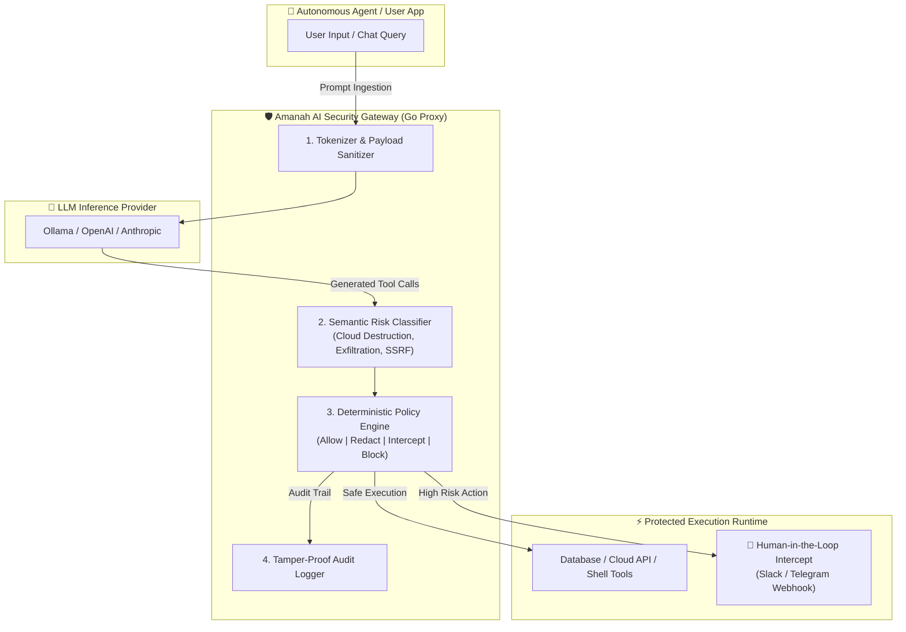

As autonomous AI agents and Large Language Models (LLMs) gain tool-calling capabilities—executing database queries, triggering AWS CLI commands, and invoking external APIs—the security perimeter changes fundamentally.

In traditional web applications, input validation is deterministic: you sanitize strings against SQL injection and cross-site scripting (XSS). With LLMs, however, user input, system prompts, retrieval-augmented generation (RAG) context, and tool responses all share the exact same unstructured context window. 

If an attacker successfully injects instructions (e.g., via a poisoned PDF, untrusted web scrape, or direct prompt manipulation), the model can be tricked into generating destructive tool calls:

```json
{
  "tool": "execute_cloud_command",
  "arguments": {
    "command": "aws ec2 terminate-instances --instance-ids i-0a1b2c3d4e5f"
  }
}
```

To solve this problem at runtime, I built **Amanah AI Gateway & Firewall**—a lightweight, high-performance security proxy written in **Go** that sits directly between LLM inference engines and external tool executors.

---

## High-Level Architecture & Request Flow

The core philosophy of Amanah AI Gateway is **zero-trust tool mediation**. LLMs are treated as untrusted reasoning engines. Every tool-call JSON payload generated by the model must pass through lexical classification, AST-based argument inspection, and policy evaluation before reaching the execution environment.



---

## Core Security Engine Modules

Amanah AI Gateway is organized into four core functional subsystems in Go:

### 1. The Interception Proxy Handler

The proxy wraps standard HTTP/gRPC transport layers, providing sub-2 millisecond latency overhead. It transparently unpacks OpenAI/Anthropic/Ollama compatible tool-call schemas:

```go
package gateway

import (
	"encoding/json"
	"net/http"
	"time"
)

type ToolCall struct {
	ID        string          `json:"id"`
	Type      string          `json:"type"`
	Function  FunctionCall    `json:"function"`
}

type FunctionCall struct {
	Name      string          `json:"name"`
	Arguments json.RawMessage `json:"arguments"`
}

type InterceptResult struct {
	Decision    PolicyDecision `json:"decision"` // ALLOW, BLOCK, REQUIRE_APPROVAL
	RiskScore   float64        `json:"risk_score"`
	Category    string         `json:"category"`
	Reason      string         `json:"reason"`
}

func (g *Gateway) HandleToolCall(w http.ResponseWriter, r *http.Request) {
	var tool ToolCall
	if err := json.NewDecoder(r.Body).Decode(&tool); err != nil {
		http.Error(w, "Invalid payload", http.StatusBadRequest)
		return
	}

	// Evaluate payload against active security policy
	eval := g.PolicyEngine.Evaluate(tool)
	
	switch eval.Decision {
	case DecisionAllow:
		g.ForwardToExecutor(w, tool)
	case DecisionBlock:
		g.ReturnSecurityRefusal(w, tool, eval.Reason)
	case DecisionRequireApproval:
		g.TriggerApprovalFlow(w, tool, eval)
	}
}
```

---

### 2. Risk Classification & Threat Categories

The gateway evaluates arguments against four primary threat signatures:

1. **`cloud_destruction`**: Irreversible infrastructure commands (e.g., `terminate-instances`, `delete-cluster`, `drop database`, `terraform destroy`, `rm -rf /`).
2. **`data_exfiltration`**: Unauthorized external data transfers (e.g., `curl -X POST -d @/etc/passwd`, suspicious webhooks, DNS tunneling attempts).
3. **`privilege_escalation`**: IAM role modifications, Kubernetes ClusterRoleBinding changes, or token theft.
4. **`ssrf_attempt`**: Requests targeting cloud metadata endpoints (`169.254.169.254`, `metadata.google.internal`) or loopback interfaces.

```go
func (e *Engine) ClassifyRisk(funcName string, args string) (RiskCategory, float64) {
	// Destructive Cloud Patterns
	if matchCloudDestruction(args) {
		return CategoryCloudDestruction, 0.95
	}

	// SSRF Metadata Service Targeting
	if strings.Contains(args, "169.254.169.254") || strings.Contains(args, "metadata.google") {
		return CategorySSRF, 1.00
	}

	// SQL Drop/Truncate Guardrails
	if isDestructiveSQL(args) {
		return CategoryDataDestruction, 0.90
	}

	return CategoryBenign, 0.05
}
```

---

### 3. Human-in-the-Loop Intercept Mode

When a tool call exceeds the risk threshold (e.g., risk score > `0.70`), the gateway pauses downstream execution and holds the HTTP connection. It broadcasts a cryptographically signed authorization request to Telegram/Slack:

```
🚨 AMANAH AI SECURITY GATEWAY ALERT 🚨
Decision: INTERCEPTED (Risk Score: 0.95)
Model: DeepSeek-R1 (Tool Call ID: tc_9281a)
Function: execute_bash
Proposed Command:
  $ aws s3 rb s3://production-customer-backups --force

Action Required:
[ ✅ APPROVE EXECUTION ]   [ ❌ REJECT & TERMINATE ]
```

If the administrator rejects the request or the 60-second timeout expires, the gateway returns a polite tool execution error to the LLM context, explaining that the operation was denied by security policy.

---

## Performance & Overhead Benchmark

Because Amanah AI Gateway is written in Go with zero external runtime dependencies, its proxy latency is negligible compared to LLM inference times:

| Metric | Target / Measured Result |
|---|---|
| **Memory Footprint** | ~14 MB RSS in Docker |
| **Proxy Latency Overhead** | **1.2 ms** (P50) / **2.4 ms** (P99) |
| **Throughput** | 8,500+ requests/sec on single core |
| **Dependency Footprint** | Pure Go stdlib (`net/http`, `crypto`, `regexp`) |

---

## Key Lessons Learned

1. **Never trust raw model output:** Even top-tier models can hallucinate destructive shell syntax or fall prey to adversarial context injection.
2. **Deterministic guardrails beat probabilistic prompts:** Telling an LLM *"Please do not delete databases"* in the system prompt fails when subjected to advanced token smuggling. A deterministic proxy handler in Go never hallucinates.
3. **Audit trails are critical:** Logging the exact prompt, token stream, and tool arguments with SHA-256 integrity hashes makes post-incident forensic auditing straightforward.

---

*Amanah AI Gateway runs 24/7 on my Debian homelab, actively shielding local Ollama instances and automated agent pipelines.*
