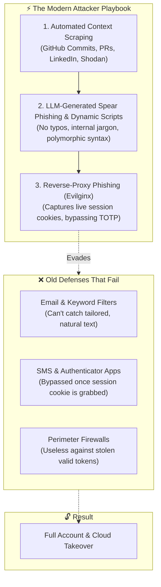
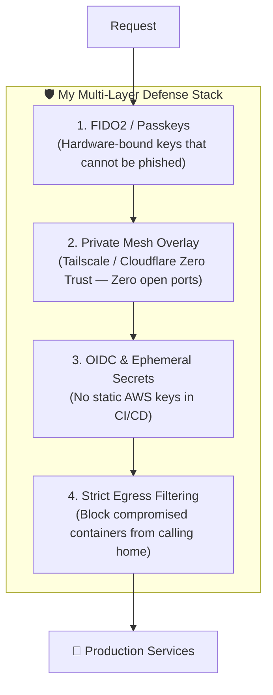

If you spend any time inspecting edge logs on a public VPS, cloud VPC, or even a modest homelab router, you have probably noticed a dramatic shift over the past year. 

It used to be that public internet noise was fairly predictable. You would see routine bots scanning for open port 22, script kiddies trying `/wp-admin` on non-WordPress sites, and obvious phishing emails with broken grammar and mismatched sender domains.

That era is over.

Over the last several months, the volume and sophistication of automated attacks have surged. Today, open-source offensive tools combined with local LLMs allow attackers to automate reconnaissance, scrape repository histories, draft context-aware phishing lures, and bypass traditional two-factor authentication (2FA) with reverse proxies.

Whether you are running a production platform, building an indie app, or maintaining a privacy-first project like **Digital Amanah**, the reality is simple: **everyone is a target now because the scanning is completely automated.**

In this post, I want to break down what is actually driving this uptick in cyberattacks, why traditional perimeter defenses are failing, and the exact zero-trust engineering patterns I use to lock down my infrastructure.

---

## 1. What Has Changed? (The Anatomy of the Surge)

The uptick in attacks is not just about raw numbers. It is about how low the barrier to entry has become for executing advanced attacks.



### A. The "Small Target" Fallacy Is Dead
A common mindset among developers is: *"I'm just running a small side project, why would anyone target me?"*

Attackers are not sitting at a terminal hand-typing IP addresses. They run continuous, distributed scanners against the entire IPv4 space. The second you spin up a cloud VM or expose a port on your home router, bots hit it within minutes trying known CVEs, default credentials, and misconfigured API routes. You are not being targeted personally—you are being swept up in an automated net.

### B. Precision Phishing Without the "Tells"
Phishing used to be easy to spot: weird sender addresses, terrible spelling, and generic greetings. 

Now, automated pipelines can scrape your public GitHub commits, pull request discussions, and team updates, then feed that context into an LLM to generate an email that looks like an urgent internal message from a collaborator or vendor. There are no grammatical tells anymore.

### C. Session Hijacking (Why Basic 2FA Is No Longer Enough)
Most people assume that having an authenticator app (TOTP) or SMS 2FA makes them bulletproof. Unfortunately, tools like **Evilginx** (Adversary-in-the-Middle reverse proxies) have changed the game.

When a user clicks a malicious link, the reverse proxy sits between them and the real login service (like Google, GitHub, or Okta). The user logs in and enters their 2FA code. The real service grants access, but the reverse proxy **intercepts the authenticated session cookie**. The attacker drops that cookie into their own browser and is logged in immediately—without ever needing your password or 2FA seed.

---

## 2. Why Old Defenses Are Breaking

The reason traditional security setups are struggling comes down to three flawed assumptions:

1. **Relying on signature-based detection:** Attackers can ask an LLM to rewrite a Python or Go script 50 different ways with the same functional behavior. The file hash (SHA-256) changes every single time, rendering basic signature antivirus useless.
2. **Treating authentication as a single point in time:** Verifying a password once at login is not enough if the resulting bearer token or session cookie is stolen and used from an IP across the globe.
3. **Leaving internal ports exposed to the public internet:** If your database, staging environment, or admin dashboard has a public IP address, it is only a matter of time before someone finds a way in.

---

## 3. How I Protect My Stack: A Practical Zero-Trust Blueprint

To protect Digital Amanah, my homelab, and cloud workloads, I rely on deterministic, zero-trust patterns. Here is what that looks like in practice.



---

### Step 1: Upgrading to Hardware-Bound Authentication (Passkeys / WebAuthn)

Because session hijacking and reverse proxies defeat SMS and TOTP codes, the only true defense against phishing is **FIDO2 / WebAuthn Passkeys** (using a YubiKey, Apple Touch ID, or Windows Hello).

With WebAuthn, the browser cryptographically signs a challenge using a private key locked inside your hardware enclave. Crucially, the browser **binds the signature to the exact domain origin** (e.g., `digitalamanah.com`). If an attacker tricks you onto `digitalamanah-login.com`, the hardware key simply refuses to authenticate.

Here is a practical example of how I handle WebAuthn registration verification on the server side using TypeScript:

```typescript
import { verifyRegistrationResponse } from '@simplewebauthn/server';

export async function verifyUserPasskey(req: Request) {
  const { body, expectedChallenge, expectedOrigin } = await req.json();

  const verification = await verifyRegistrationResponse({
    response: body,
    expectedChallenge,
    expectedOrigin: 'https://digitalamanah.com', // Strict origin binding
    expectedRPID: 'digitalamanah.com',
    requireUserVerification: true,
  });

  if (!verification.verified || !verification.registrationInfo) {
    throw new Error('WebAuthn verification failed: invalid cryptographic signature');
  }

  const { credentialPublicKey, credentialID, counter } = verification.registrationInfo;

  // Save credentialID and public key in database bound to user session
  return { success: true, credentialID, credentialPublicKey, counter };
}
```

---

### Step 2: Closing All Public Ports with Tailscale & Zero-Trust Overlays

I do not expose SSH, database ports, or staging dashboards to the public internet. Period.

Instead, all my internal services (homelab nodes, staging databases, Grafana dashboards, and private Kubernetes control planes) run inside a private **Tailscale** overlay network. 

If a bot scans my public IP, it sees nothing—ports are completely closed. Only devices authenticated to my Tailnet with strict tag-based ACLs can route traffic:

```json
// Tailscale ACL policy enforcing least privilege
{
  "acls": [
    // Developers can only connect to the staging database on port 5432
    {
      "action": "accept",
      "src": ["group:engineers"],
      "dst": ["tag:staging-db:5432"]
    },
    // Production servers can only be accessed by authenticated admin keys
    {
      "action": "accept",
      "src": ["group:secops-admin"],
      "dst": ["tag:prod-cluster:443", "tag:prod-cluster:6443"]
    }
  ]
}
```

---

### Step 3: Eliminating Static Secrets with OIDC

One of the easiest ways developers get compromised is through infostealer malware grabbing `.env` files or hardcoded AWS access keys from repositories.

In my CI/CD workflows, I have completely phased out static `AWS_ACCESS_KEY_ID` and `AWS_SECRET_ACCESS_KEY` secrets. Instead, I use **OpenID Connect (OIDC)** to request short-lived STS tokens that expire automatically after the build completes:

```yaml
# GitHub Actions using OIDC for AWS deployments (Zero Static Secrets)
name: Deploy Infrastructure
on:
  push:
    branches: [main]

permissions:
  id-token: write # Required for generating OIDC token
  content: read

jobs:
  deploy:
    runs-on: ubuntu-latest
    steps:
      - name: Authenticate to AWS via OIDC
        uses: aws-actions/configure-aws-credentials@v4
        with:
          role-to-assume: arn:aws:iam::123456789012:role/github-actions-deploy-role
          role-session-name: GitHubActionsDeployment
          aws-region: us-east-1
          # Credentials are short-lived and discarded after this step
```

---

### Step 4: Strict Container Egress Filtering

When an attacker manages to exploit an application (e.g., through a vulnerable dependency), their first step is usually to establish a reverse shell or exfiltrate environment variables.

Most people only think about *ingress* firewalls, but **egress filtering** is just as important. If your container only needs to talk to your database and Supabase API, block everything else at the firewall layer:

```bash
# Drop all outgoing container traffic by default
sudo iptables -P OUTPUT DROP

# Allow established connections and local loopback
sudo iptables -A OUTPUT -m conntrack --ctstate ESTABLISHED,RELATED -j ACCEPT
sudo iptables -A OUTPUT -o lo -j ACCEPT

# Allow outbound traffic strictly to necessary API endpoints (DNS & HTTPS)
sudo iptables -A OUTPUT -p tcp -d 1.1.1.1 --dport 53 -j ACCEPT
sudo iptables -A OUTPUT -p tcp -d api.supabase.com --dport 443 -j ACCEPT
```

If a malicious script tries to `curl` an external attacker server or drop a backdoor, the connection drops silently.

---

## 4. Cybersecurity as an Amanah

The word **Amanah** (أمانة) means a sacred trust, a moral duty, and the responsibility of custodianship over things placed in your care.

In the tech world, it is easy to look at cybersecurity through the lens of compliance checkboxes, corporate audits, or insurance requirements. But when you build software, run servers, or manage family networks, you are acting as a custodian:

* **Your users** trust you to keep their private thoughts, accounts, and data safe from surveillance and leaks.
* **Your team** trusts you to protect deployment pipelines from supply-chain attacks.
* **Your family** trusts you to keep home devices, cameras, and networks safe from extortion and bad actors.

Treating security as an *Amanah* means not taking shortcuts. It means assuming that automated threats are knocking on the door 24/7, and building architectures that protect that trust by design—not by luck.

---

## 5. My Personal Hardening Checklist

If you want to quickly harden your own setup against the current wave of attacks, here is the checklist I recommend:

| Area | Action Item | Why It Matters |
|---|---|---|
| **Identity** | Turn on Passkeys / FIDO2 on GitHub, Google, AWS, and password managers. | Completely neutralizes reverse-proxy phishing (Evilginx). |
| **Secrets** | Replace static cloud keys in CI/CD with **OIDC federation**. | Makes repository leaks harmless since there are no permanent secrets. |
| **Network** | Move internal tools, homelabs, and admin panels behind **Tailscale**. | Stops automated bot scans by closing public-facing ports. |
| **Endpoints** | Use a passkey-protected password manager and enable full disk encryption. | Protects credentials from commodity infostealer malware. |
| **Egress** | Restrict outbound network rules on servers and containers. | Prevents reverse shells and data exfiltration if an app is compromised. |

---

## Wrapping Up

The uptick in cyberattacks is not something that is going away—if anything, automation will make it more pervasive. But we do not have to be passive targets.

By ditching phishable passwords, closing public attack surfaces with mesh networks, killing static API keys, and remembering our duty of care, we can build systems that stay secure no matter how noisy the internet gets.

*Security is not about hoping you never get attacked—it is about designing a system that holds the line when you do.*
