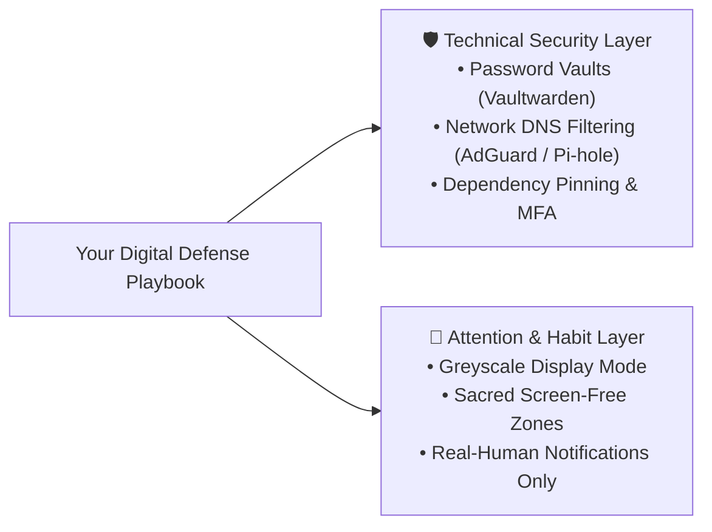

Hardly a week goes by without another alarming cybersecurity headline. In recent months, the scale and frequency of compromises have shattered historical records:

* **The National Public Data (NPD) Broker Leak:** An unvetted data broker suffered a catastrophic leak exposing nearly **2.9 billion records**, including Social Security Numbers, full residential histories, and background dossiers for hundreds of millions of citizens.
* **The Snowflake Cloud & Telecom Breaches:** Attackers utilized credential stuffing against cloud data warehouses lacking mandatory multi-factor authentication (MFA), exfiltrating call and text metadata for tens of millions of mobile users at AT&T and Ticketmaster.
* **Open-Source & NPM Supply Chain Takeovers:** Cybercriminals increasingly bypass perimeter firewalls by poisoning the open-source software libraries that power our favorite web and mobile applications.

For most people, breach fatigue has set in. We receive another automated notification, reset a password, and carry on with our day.

But if we look beneath the surface, these breaches are not isolated accidents. They are the inevitable byproduct of two compounding crises: **surveillance capitalism's endless data hoarding**, and **the fragile open-source supply chains built to keep us glued to our screens.**

---

## 1. The Real Cost of "Free": You Are the Extracted Resource

In the physical economy, industrial companies extract oil, timber, and minerals. In the modern digital economy, **your attention and behavioral patterns are the primary natural resource.**

Every time you scroll, pause on a video for three extra seconds, or click a trending topic, thousands of telemetry data points are recorded:

* What emotional triggers keep you awake past midnight?
* What controversies provoke your engagement?
* What personal transitions (job changes, school prep, family stress) make you receptive to targeted advertisements?

Because capturing your screen time is the core revenue engine of Big Tech, platforms collect and hoard every conceivable metric. They buy and sell your data across shadowy broker networks to enrich behavioral profiles.

When these companies inevitably get breached, it isn't just an email address that leaks, it is the intimate blueprint of your digital identity.

---

## 2. The Hidden Threat: NPM & Open-Source Supply Chain Attacks

While data broker leaks happen on backend servers, another insidious threat is happening directly inside the apps installed on our phones and computers: **Software Supply Chain Poisoning**.

### What is an NPM Supply Chain Attack?

Modern web platforms and mobile apps are not built from scratch. Developers rely on open-source ecosystems like **NPM (Node Package Manager)**, pulling in thousands of nested third-party packages to handle UI components, analytics, and animations.

In a supply chain attack, malicious actors don't target the main company directly. Instead, they compromise a small, overlooked open-source library that the company's developers depend on:

1. **Account Takeover / Stolen Tokens:** Attackers compromise an open-source maintainer's GitHub or NPM account (often via phishing or unrotated CI/CD API tokens).
2. **Malicious Payload Injection:** The attacker publishes a minor version update (e.g., `v1.2.4`) containing hidden code that harvests environment variables, steals cryptocurrency, or silently exfiltrates form inputs.
3. **Automated Infection:** The next time companies build and deploy their web apps, their automated CI/CD pipelines pull the poisoned package, shipping malware directly to millions of unsuspecting end users.

```text
[Attacker Compromises Maintainer Token]
                  │
                  ▼
[Injected Malicious Code into Popular NPM Library]
                  │
                  ▼
[App CI/CD Builds Production Bundle]
                  │
                  ▼
[End User's Browser / Phone Runs Trojanized Script]
```

### The Link to the Attention Economy

Why are modern apps so vulnerable to supply chain attacks? **Because ad-funded, attention-driven apps are bloated with tracking libraries.**

To maximize engagement and ad targeting, consumer apps frequently embed dozens of unvetted third-party SDKs: session recorders, analytics beacons, behavioral telemetry trackers, and ad-exchange plugins. Each third-party tracker introduces dozens of sub-dependencies, expanding the attack surface exponentially.

When you use "free," ad-saturated apps that aggressively fight for your attention, you aren't just losing your time, you are running hundreds of untrusted, third-party code packages on your private devices.

---

## 3. Engineered Addiction: How Platforms Keep You Trapped

Why is it so difficult to put the phone down after "just checking one thing"?

It is not a personal lack of discipline. You are competing against advanced machine learning algorithms and behavioral psychologists whose sole objective is to maximize your time on screen.

### A. The "Slot Machine" Dopamine Loop

When you pull down to refresh a social media feed, that brief delay before new content loads is engineered. It mimics the mechanics of a casino slot machine. Because the brain cannot predict whether the next pull will deliver a boring post or an exciting notification, dopamine surges in anticipation.

### B. Outrage-Driven Algorithmic Feeds

Engagement algorithms do not optimize for peace or truth; they optimize for **visceral reaction**. Human psychology reacts far more intensely to controversy, fear, and moral outrage than to calm reflection. Extractive platforms amplify polarizing content because it keeps users arguing in comment sections for hours.

### C. The Erasure of Natural Stopping Cues

Physical activities have natural stopping points: books have chapters, newspapers have back pages, and TV shows have credits. Modern apps deliberately eliminate stopping cues with infinite scroll, algorithmic autoplay, and disappearing stories, putting our executive focus into continuous paralysis.

---

## 4. The Toll on Families and Mental Focus

When surveillance-driven design takes over our homes, the costs compound quickly:

1. **Destruction of Deep Focus:** Rapid-fire micro-content trains the brain to reject long-form study, technical reading, and deep contemplation.
2. **Displaced Family Connection:** Families may sit in the same living room, yet each person is isolated inside their own personalized algorithmic bubble.
3. **Chronic Anxiety & Sleep Disruption:** Blue light and late-night doomscrolling elevate cortisol levels and disrupt sleep architecture, leaving adults and children chronically exhausted.

---

## 5. Reclaiming Your Digital Sovereignty: The Dual Defense Playbook

Protecting your household requires a two-front strategy: **hardening your technical security** against supply chain threats and breaches, while **designing physical friction** to defeat algorithmic addiction.



### 🛡️ Layer 1: Technical Hardening

* **Deploy a Zero-Knowledge Password Manager:** Stop reusing passwords across multiple sites. Use an end-to-end encrypted vault (like self-hosted **Vaultwarden** or Bitwarden) so a breach at one data broker never compromises your other accounts.
* **Block Trackers at the Network Level:** Use network DNS firewalls (like AdGuard Home, NextDNS, or Pi-hole) to block analytics beacons, ad trackers, and known malicious telemetry endpoints across all family devices at the router level.
* **For Developers: Lock Down Your Supply Chain:**
  * Always commit your `package-lock.json` to prevent automatic pulling of unvetted sub-dependencies.
  * Enforce hardware security keys (FIDO2/WebAuthn) for GitHub and NPM publishing.
  * Integrate automated vulnerability scanners (`npm audit`, Snyk, Dependabot) in your CI/CD pipelines.

### 🌿 Layer 2: Attention & Environment Design

* **Switch Screens to Greyscale:** In your phone's accessibility settings, create a shortcut to make your display black and white. Stripping away vibrant red notification badges immediately turns your phone from an addictive toy into a quiet tool.
* **Establish Sacred Offline Zones:** Keep phones and tablets out of bedrooms overnight, and declare the dining table a strict screen-free sanctuary.
* **Silence Non-Human Notifications:** Disable alerts for likes, trending topics, and automated app suggestions. Keep notifications active only for direct messages and calls from real human beings.

---

## Conclusion: Treating Your Attention as a Sacred Trust

In our values-based philosophy, **your time, your focus, and your personal data are a sacred trust (an *Amannah*)**. Every hour lost to mindless scrolling or surrendered to extractive platforms is an hour stolen from your family, your craft, and your spiritual growth.

Massive data leaks and software supply chain attacks prove that Big Tech will not safeguard your privacy or your peace of mind. By choosing privacy-respecting tools, hardening our systems, and setting intentional boundaries, we can reclaim our technology as a quiet servant rather than a demanding master.
