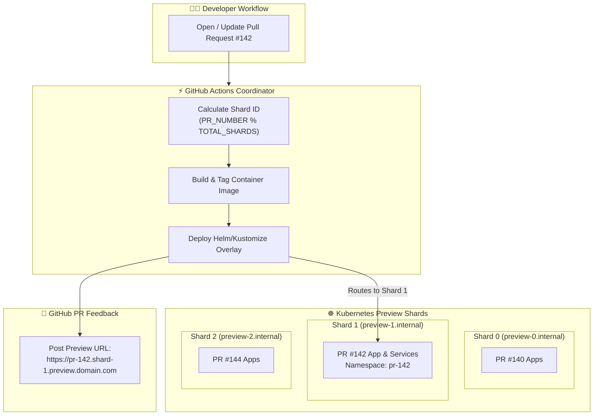

Few things improve the developer feedback loop like ephemeral preview environments. Being able to open a pull request, push a commit, and immediately get a live, clickable URL to test your changes with your team makes review cycles much faster.

When you have only a couple of active pull requests, running a preview environment is straightforward. You spin up a container or a Kubernetes namespace, point a subdomain at it, and you are done.

However, as engineering teams grow and 15 or 20 developers open PRs at the same time, this simple setup quickly starts to break down.

In this post, I want to share how we ran into those scaling bottlenecks and how we designed a sharded preview environment architecture using GitHub Actions, Kubernetes, and automated lifecycle cleanup.

---

## Where the Traditional Setup Breaks Down

When we first deployed preview environments, everything lived in a single shared preview cluster inside dedicated namespaces. It worked well at first, but as our team scaled, we ran into several painful bottlenecks:

1. **Runner Concurrency Choke Points:** Everyone was waiting on CI runner queues because heavy end-to-end integration tests and container builds ran simultaneously on the same runner pools.
2. **Ingress and Port Collisions:** Multiple PRs occasionally clashed on ingress rules, shared cache instances, or external mock dependencies.
3. **Noisy Neighbor Resource Contention:** One resource-intensive PR with memory leaks or high CPU usage during tests would crash pods in other developers' preview namespaces.
4. **Orphaned Infrastructure:** PRs closed outside of standard GitHub UI flows (like force-pushed rebases or deleted forks) often skipped the cleanup step, leaving dozens of idle pods running and driving up cloud costs.

To solve this, we needed two things: **deterministic sharding** to isolate preview workloads and **bulletproof lifecycle management** to guarantee zero stale infrastructure.

---

## Architecture: Sharded Ephemeral Previews

Instead of treating our preview infrastructure as a single monolithic environment, we partitioned our preview cluster into distinct **shards**. Each shard operates as an isolated execution lane with its own dedicated node pools, ingress domain namespace, and resource quotas.

Here is what the end-to-end flow looks like from PR creation to teardown:



---

## Step 1: Deterministic Shard Routing in GitHub Actions

The first step was assigning incoming pull requests to a shard. We opted for a deterministic modulo calculation based on the pull request number.

This approach gives us two big benefits:
* It requires zero external state or database to look up which shard a PR belongs to.
* Subsequent commits on the same pull request always route to the exact same shard, allowing us to perform fast, in-place rolling updates instead of redeploying from scratch.

Here is a simplified snippet of our GitHub Actions routing job:


```yaml
name: Deploy Ephemeral PR Preview

on:
  pull_request:
    types: [opened, synchronize, reopened]

env:
  TOTAL_SHARDS: 3
  REGISTRY: ghcr.io/${{ github.repository }}

jobs:
  route-and-deploy:
    runs-on: ubuntu-latest
    steps:
      - name: Checkout Code
        uses: actions/checkout@v4

      - name: Calculate Target Shard
        id: shard
        run: |
          PR_NUM="${{ github.event.pull_request.number }}"
          SHARD_INDEX=$(( PR_NUM % TOTAL_SHARDS ))
          NAMESPACE="pr-${PR_NUM}"
          PREVIEW_HOST="pr-${PR_NUM}.shard-${SHARD_INDEX}.preview.example.com"
          
          echo "shard_index=${SHARD_INDEX}" >> "$GITHUB_OUTPUT"
          echo "namespace=${NAMESPACE}" >> "$GITHUB_OUTPUT"
          echo "preview_host=${PREVIEW_HOST}" >> "$GITHUB_OUTPUT"
          
          echo "Assigned PR #${PR_NUM} to Shard ${SHARD_INDEX} (Namespace: ${NAMESPACE})"

      - name: Build and Push Preview Image
        run: |
          IMAGE_TAG="pr-${{ github.event.pull_request.number }}-${{ github.sha }}"
          docker build -t "${REGISTRY}/web-app:${IMAGE_TAG}" .
          docker push "${REGISTRY}/web-app:${IMAGE_TAG}"
```


---

## Step 2: Provisioning Isolated Namespaces

Once the shard is identified, the workflow targets that specific shard cluster or node group and applies a customized Kustomize overlay.

Each PR gets its own Kubernetes `Namespace` with strict `ResourceQuota` and `LimitRange` rules. This ensures a memory leak in one preview container never impacts another developer's workload.

Here is an example of the resource quota applied automatically during each preview creation:

```yaml
apiVersion: v1
kind: ResourceQuota
metadata:
  name: pr-compute-quota
spec:
  hard:
    requests.cpu: "2"
    requests.memory: 4Gi
    limits.cpu: "4"
    limits.memory: 8Gi
    pods: "10"
---
apiVersion: v1
kind: LimitRange
metadata:
  name: pr-compute-limits
spec:
  limits:
    - default:
        cpu: 500m
        memory: 512Mi
      defaultRequest:
        cpu: 100m
        memory: 128Mi
      type: Container
```

---

## Step 3: Wildcard DNS and Dynamic Ingress

Creating individual DNS A-records for every single PR is slow and introduces unwanted propagation delays.

Instead, we configured wildcard DNS records pointing to the ingress controller on each shard:

* `*.shard-0.preview.example.com` $\rightarrow$ Shard 0 Ingress Controller
* `*.shard-1.preview.example.com` $\rightarrow$ Shard 1 Ingress Controller
* `*.shard-2.preview.example.com` $\rightarrow$ Shard 2 Ingress Controller

With wildcard DNS in place, creating an ingress for a new PR preview takes less than two seconds:


```yaml
apiVersion: networking.k8s.io/v1
kind: Ingress
metadata:
  name: web-ingress
  annotations:
    kubernetes.io/ingress.class: nginx
    nginx.ingress.kubernetes.io/proxy-body-size: "10m"
spec:
  rules:
    - host: ${{ steps.shard.outputs.preview_host }}
      http:
        paths:
          - path: /
            pathType: Prefix
            backend:
              service:
                name: web-service
                port:
                  number: 8080
```


Because the domain matches the wildcard DNS pattern, the preview environment is reachable the instant the Ingress controller registers the routing rule.

---

## Step 4: Automated PR Feedback

Developers shouldn't have to look through CI logs to find their preview links. We added an automated step that posts a sticky comment on the pull request containing the active URL and deployment status.


```yaml
      - name: Update PR with Preview URL
        uses: actions/github-script@v7
        with:
          script: |
            const prNumber = context.payload.pull_request.number;
            const host = "${{ steps.shard.outputs.preview_host }}";
            const sha = context.sha.substring(0, 7);
            
            const body = `### 🚀 PR Preview Environment Ready
            
            - **Status:** Deployed ✅
            - **Commit:** \`${sha}\`
            - **Preview URL:** [https://${host}](https://${host})
            - **Shard:** \`shard-${{ steps.shard.outputs.shard_index }}\`
            
            *This environment is automatically destroyed when the PR is closed.*`;
            
            // Find existing bot comment to update or create new one
            const comments = await github.rest.issues.listComments({
              owner: context.repo.owner,
              repo: context.repo.repo,
              issue_number: prNumber,
            });
            
            const botComment = comments.data.find(comment => 
              comment.user.login === 'github-actions[bot]' && 
              comment.body.includes('PR Preview Environment Ready')
            );
            
            if (botComment) {
              await github.rest.issues.updateComment({
                owner: context.repo.owner,
                repo: context.repo.repo,
                comment_id: botComment.id,
                body: body
              });
            } else {
              await github.rest.issues.createComment({
                owner: context.repo.owner,
                repo: context.repo.repo,
                issue_number: prNumber,
                body: body
              });
            }
```


---

## Step 5: The Cleanup Strategy (Handling Merged PRs and Stale Leaks)

Creating environments is easy; cleaning them up reliably is where most setups fail.

We use a two-tier cleanup strategy to ensure no orphaned resources slip through:

### 1. Event-Driven Cleanup (On PR Close)
Whenever a PR is closed or merged, a dedicated teardown workflow deletes the corresponding namespace immediately.


```yaml
name: Teardown PR Preview

on:
  pull_request:
    types: [closed]

jobs:
  teardown:
    runs-on: ubuntu-latest
    steps:
      - name: Calculate Target Shard
        id: shard
        run: |
          PR_NUM="${{ github.event.pull_request.number }}"
          SHARD_INDEX=$(( PR_NUM % 3 ))
          echo "namespace=pr-${PR_NUM}" >> "$GITHUB_OUTPUT"
          echo "shard_index=${SHARD_INDEX}" >> "$GITHUB_OUTPUT"

      - name: Delete Kubernetes Namespace
        run: |
          kubectl delete namespace "${{ steps.shard.outputs.namespace }}" --ignore-not-found=true
```


### 2. Scheduled Sweeper (Garbage Collection Cron)
Sometimes GitHub webhooks fail, or branches get deleted directly without triggering a standard close event.

To prevent leaks, we run a nightly sweeper workflow that queries active namespaces across all shards, checks whether the matching pull request is still open on GitHub, and deletes any orphaned namespaces that are older than 24 hours.

```bash
#!/usr/bin/env bash
set -euo pipefail

echo "Scanning for orphaned preview namespaces..."

for ns in $(kubectl get ns -o jsonpath='{.items[*].metadata.name}' | tr ' ' '\n' | grep '^pr-'); do
  PR_NUM="${ns#pr-}"
  
  # Check PR status via GitHub CLI
  PR_STATE=$(gh pr view "$PR_NUM" --json state --jq .state 2>/dev/null || echo "NOT_FOUND")
  
  if [ "$PR_STATE" != "OPEN" ]; then
    echo "Namespace $ns belongs to PR #$PR_NUM with state '$PR_STATE'. Deleting..."
    kubectl delete namespace "$ns" --wait=false
  else
    echo "Namespace $ns belongs to active PR #$PR_NUM. Skipping."
  fi
done
```

---

## The Results: Faster Feedback, Zero Leftover Costs

After rolling out this sharded model, the improvements were noticeable almost immediately:

* **Queue Times:** CI wait times for preview deployments dropped from roughly 20 minutes during peak hours to under 4 minutes.
* **Zero Collisions:** Sharding and strict per-namespace resource quotas eliminated noisy-neighbor crashes completely.
* **Cost Efficiency:** Automated teardowns combined with the nightly sweeper cron stopped all idle pod leaks, keeping our cloud spend predictable.

If you are planning to build or refactor ephemeral preview environments for your team, start with strict isolation, wildcard routing, and automated cleanup from day one. It saves a lot of headaches later on.

---

Have you implemented preview environments in your CI/CD setup? I would love to hear how your team approaches isolation and routing. Feel free to connect or share your thoughts!
