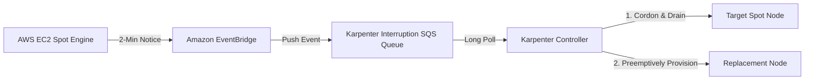

Scaling worker nodes in Kubernetes has historically relied on the Kubernetes Cluster Autoscaler. While Cluster Autoscaler is battle-tested, its tight coupling with cloud provider abstractions introduces friction in dynamic environments. On AWS, Cluster Autoscaler does not manage EC2 instances directly. Instead, it adjusts the desired capacity of EC2 Auto Scaling Groups, waiting for AWS to launch an instance and for the kubelet to bootstrap and register with the control plane.

For clusters running varied workloads, rapid CI/CD test runners, or fluctuating microservices, this multi-step indirection leads to slow provisioning cycles, inefficient bin-packing, and high infrastructure costs.

Karpenter solves this by bypassing Auto Scaling Groups entirely. It communicates directly with the AWS EC2 Fleet API, evaluating pending pod requirements and launching right-sized compute in seconds.

Here is a practical guide to the architectural differences, the modern Karpenter v1 configuration, and how to execute a zero-downtime migration from Cluster Autoscaler.

---

## The Architectural Shift

Understanding why Karpenter outperforms Cluster Autoscaler requires looking at how each controller reacts when a pod enters a pending state.

### Cluster Autoscaler: Indirection Through Auto Scaling Groups

When a pod cannot be scheduled due to insufficient CPU or memory, Cluster Autoscaler follows a reactive path:

1. Pod enters Pending state due to lack of schedulable node capacity.
2. Cluster Autoscaler periodically scans unschedulable pods.
3. It identifies which predefined Auto Scaling Group (ASG) satisfies the pod constraints (instance type, architecture, labels, taints).
4. It calls the AWS EC2 Auto Scaling API to increment the desired capacity of the matching ASG.
5. The ASG launches the EC2 instance.
6. The instance initializes, pulls user-data, starts the kubelet, and joins the cluster.
7. The Kubernetes scheduler detects the new node and binds the pending pod.

This loop commonly takes between 2 to 5 minutes. If workloads require diverse machine shapes (such as memory-heavy pods alongside compute-heavy pods and GPU workers), platform engineers must pre-create dozens of separate Auto Scaling Groups.

### Karpenter: Direct Fleet Orchestration and Group-less Autoscaling

Karpenter replaces Auto Scaling Group management with direct EC2 Fleet provisioning:

1. Karpenter watches the Kubernetes API server for unschedulable pods.
2. It evaluates the exact aggregate scheduling requirements (CPU, memory, storage, topology spread, zone preferences, and instance types).
3. It executes a bin-packing algorithm to select the optimal instance type or mixture of instances.
4. It calls the AWS EC2 Fleet API directly (`ec2:CreateFleet`).
5. The instance initializes and registers directly with the cluster.
6. Pods bind immediately to the new capacity.

Because Karpenter bypasses the ASG control plane and provisions instances tailored to pending workloads, node readiness drops to 40 to 60 seconds.

```mermaid
flowchart TD
    subgraph ClusterAutoscalerFlow["Cluster Autoscaler Flow (2 to 5 Minutes)"]
        CA_Pod["Pending Pod"] --> CA_Scan["Scan Unschedulable Pods"]
        CA_Scan --> CA_ASG["Update ASG Desired Capacity"]
        CA_ASG --> CA_EC2["AWS Launches Instance via ASG"]
        CA_EC2 --> CA_Join["Kubelet Joins Cluster"]
        CA_Join --> CA_Sched["Pod Scheduled"]
    end

    subgraph KarpenterFlow["Karpenter Flow (40 to 60 Seconds)"]
        K_Pod["Pending Pod"] --> K_Eval["Evaluate Pending Pod Specs"]
        K_Eval --> K_BinPack["Calculate Optimal EC2 Fleet Call"]
        K_BinPack --> K_Direct["Direct EC2 CreateFleet API Call"]
        K_Direct --> K_FastJoin["Node Ready and Schedulable"]
        K_FastJoin --> K_Sched["Pod Scheduled"]
    end
```



---

## Core Primitives in Karpenter v1

With Karpenter reaching v1 stability, the API transitioned away from earlier beta CRDs (`Provisioner` and `AWSNodeTemplate`) to two core primitives:

1. **NodePool (`karpenter.sh/v1`):** Defines cluster-level workload scheduling policies, limits, consolidation thresholds, and pod eviction rules.
2. **EC2NodeClass (`karpenter.k8s.aws/v1`):** Defines AWS-specific infrastructure configuration, including subnets, security groups, AMIs, IAM instance profiles or role bindings, storage volumes, and user data.

### 1. The EC2NodeClass Specification

The EC2NodeClass instructs Karpenter on where and how to launch EC2 instances inside your AWS account. It resolves target subnets and security groups dynamically using tags, eliminating hardcoded IDs:

```yaml
apiVersion: karpenter.k8s.aws/v1
kind: EC2NodeClass
metadata:
  name: default
spec:
  amiFamily: AL2023
  role: "KarpenterNodeRole-production"
  subnetSelectorTerms:
    - tags:
        karpenter.sh/discovery: "production-eks"
  securityGroupSelectorTerms:
    - tags:
        karpenter.sh/discovery: "production-eks"
  amiSelectorTerms:
    - alias: al2023@latest
  blockDeviceMappings:
    - deviceName: /dev/xvda
      ebs:
        volumeSize: 50Gi
        volumeType: gp3
        iops: 3000
        throughput: 125
        encrypted: true
        deleteOnTermination: true
  metadataOptions:
    httpEndpoint: enabled
    httpProtocolIPv6: disabled
    httpPutResponseHopLimit: 1
    httpTokens: required
```

Key configuration points:

- **`httpTokens: required`:** Enforces IMDSv2 strictly with a single hop limit to mitigate SSRF token extraction.
- **`subnetSelectorTerms`:** Allows Karpenter to discover private subnets across all availability zones tagged with `karpenter.sh/discovery`.
- **`amiFamily: AL2023`:** Selects Amazon Linux 2023 for improved boot times and modernized containerd defaults.

### 2. The NodePool Specification

The NodePool pairs with the EC2NodeClass to govern which instance types Karpenter can choose, which zones it can place workloads into, and how aggressive its consolidation policy should be:

```yaml
apiVersion: karpenter.sh/v1
kind: NodePool
metadata:
  name: default
spec:
  template:
    spec:
      nodeClassRef:
        group: karpenter.k8s.aws
        kind: EC2NodeClass
        name: default
      requirements:
        - key: "karpenter.k8s.aws/instance-category"
          operator: In
          values: ["c", "m", "r"]
        - key: "karpenter.k8s.aws/instance-generation"
          operator: Gt
          values: ["5"]
        - key: "kubernetes.io/arch"
          operator: In
          values: ["amd64", "arm64"]
        - key: "karpenter.sh/capacity-type"
          operator: In
          values: ["spot", "on-demand"]
      expireAfter: 720h # 30 days node rotation
  limits:
    cpu: 1000
    memory: 2000Gi
  disruption:
    consolidationPolicy: WhenEmptyOrUnderutilized
    consolidateAfter: 1m
    budgets:
      - nodes: "10%"
```

---

## Cost Optimization: Consolidation and Spot Interruption Handling

Karpenter delivers primary cost savings through two mechanisms: continuous consolidation and native spot lifecycle management.

### Continuous Consolidation

Cluster Autoscaler only removes nodes when they are completely empty or below a fixed utilization threshold, and it cannot replace a large node with a smaller one if existing pods fit onto a cheaper instance.

Karpenter solves this with `consolidationPolicy: WhenEmptyOrUnderutilized`. In this mode:

- If a node is completely empty, Karpenter cordons, drains, and terminates it after `consolidateAfter` expires.
- If multiple nodes are underutilized, Karpenter simulates whether the running pods can be consolidated onto a single existing node or packed into a cheaper, smaller instance.
- The `budgets` parameter ensures that consolidation does not evict more than a safe percentage of cluster nodes simultaneously.

### Spot Interruption Handling with EventBridge and SQS

Running Spot instances on Kubernetes requires handling EC2 Spot Interruption Warnings, which give a 2-minute notice before AWS reclaims an instance.

Cluster Autoscaler relies on separate external daemonsets (like the AWS Node Termination Handler) to monitor local IMDS endpoints.

Karpenter handles this natively via an SQS queue and EventBridge rules. EventBridge routes four event patterns to Karpenter:

1. EC2 Spot Instance Interruption Warnings.
2. EC2 Instance Rebalance Recommendations.
3. EC2 Scheduled Changes (maintenance events).
4. EC2 Instance State Change Notifications (unexpected terminations).



When Karpenter receives an interruption warning from SQS:

1. It immediately cordons the targeted node so no new pods can be assigned.
2. It launches a replacement node ahead of time.
3. It drains the running pods gracefully according to their termination grace periods and Pod Disruption Budgets.

---

## Step-by-Step Migration Strategy

Migrating a live cluster from Cluster Autoscaler to Karpenter must be done incrementally to prevent scheduling deadlocks or unexpected service downtime.

### Phase 1: Deploy Karpenter Alongside Existing Node Groups

Do not uninstall Cluster Autoscaler right away. Run both controllers simultaneously, ensuring they do not fight over the same compute.

1. Maintain an initial, small Managed Node Group (2 to 3 nodes) spanning multiple availability zones. This core group hosts critical cluster controllers: CoreDNS, the AWS VPC CNI, the AWS Load Balancer Controller, and the Karpenter controller itself.
2. Tag your target VPC subnets and security groups with `karpenter.sh/discovery: <cluster-name>`.
3. Configure the Karpenter IAM role using EKS Pod Identity or IRSA, granting permissions to call `ec2:CreateFleet`, `ec2:RunInstances`, `ec2:TerminateInstances`, and SQS queue consumption.
4. Deploy the Karpenter Helm chart into the `karpenter` namespace.

### Phase 2: Create NodePool and EC2NodeClass

Apply the NodePool and EC2NodeClass manifests to your cluster:

```bash
kubectl apply -f karpenter-nodeclass.yaml
kubectl apply -f karpenter-nodepool.yaml
```

Verify that Karpenter is healthy and ready to process requests:

```bash
kubectl get ec2nodeclasses
kubectl get nodepools
kubectl logs -n karpenter -l app.kubernetes.io/name=karpenter -f
```

### Phase 3: Shift Workloads to Karpenter Compute

To direct pods to Karpenter-managed compute, deploy test workloads or modify existing Deployment specs without explicit node selectors pointing to the old Managed Node Groups:

```yaml
apiVersion: apps/v1
kind: Deployment
metadata:
  name: workload-sample
  namespace: default
spec:
  replicas: 10
  selector:
    matchLabels:
      app: workload-sample
  template:
    metadata:
      labels:
        app: workload-sample
    spec:
      topologySpreadConstraints:
        - maxSkew: 1
          topologyKey: "topology.kubernetes.io/zone"
          whenUnsatisfiable: ScheduleAnyway
          labelSelector:
            matchLabels:
              app: workload-sample
      containers:
        - name: app
          image: public.ecr.aws/nginx/nginx:alpine
          resources:
            requests:
              cpu: "500m"
              memory: "512Mi"
```

Watch Karpenter immediately detect the unscheduled pods and provision nodes:

```bash
kubectl get nodes -l karpenter.sh/nodepool=default -w
```

### Phase 4: Cordon, Drain, and Retire Old Auto Scaling Groups

Once Karpenter proves reliable under workload traffic:

1. Disable or scale down Cluster Autoscaler by setting its deployment replica count to 0:

   ```bash
   kubectl scale deployment cluster-autoscaler -n kube-system --replicas=0
   ```

2. Cordon the old worker nodes managed by the legacy Auto Scaling Groups:

   ```bash
   kubectl cordon -l eks.amazonaws.com/nodegroup=legacy-workload-group
   ```

3. Gracefully drain the old nodes:

   ```bash
   kubectl drain -l eks.amazonaws.com/nodegroup=legacy-workload-group --ignore-daemonsets --delete-emptydir-data --force
   ```

4. As pods are evicted, Karpenter will provision replacement nodes dynamically to absorb them.
5. Safely delete the old Auto Scaling Groups or Managed Node Groups in your Infrastructure as Code.

---

## Production Tradeoffs and Gotchas

While Karpenter delivers significant operational and financial benefits, be mindful of these production factors:

1. **Host Critical Add-ons on Isolated Nodes:** Run Karpenter, CoreDNS, and ingress controllers on a static, non-consolidating node group. If Karpenter attempts to manage the node it is running on, aggressive consolidation can create eviction deadlocks.
2. **Pod Disruption Budgets (PDBs) are Mandatory:** Because Karpenter consolidation actively evicts pods to optimize node density, properly configured PDBs are essential to prevent unintentional service outages.
3. **Subnet IP Exhaustion:** When using the AWS VPC CNI, each pod consumes an IP address from the node subnet. If Karpenter spins up many smaller instances rather than a few large ones, secondary IP allocations can exhaust subnet CIDR blocks rapidly. Monitor your subnet IP availability.
4. **VPC CNI Warm Target Tuning:** Ensure `WARM_ENI_TARGET` or `WARM_IP_TARGET` in your AWS VPC CNI configuration is tuned properly to avoid delayed network interface attachments during rapid Karpenter scale-outs.

---

## Summary

Migrating from Cluster Autoscaler to Karpenter moves Kubernetes node autoscaling from slow, static infrastructure pools to fast, application-aware capacity provisioning. By letting Karpenter call the EC2 Fleet API directly, clusters achieve faster scale-ups, superior bin-packing, and automated spot lifecycle management without manual Auto Scaling Group overhead.
